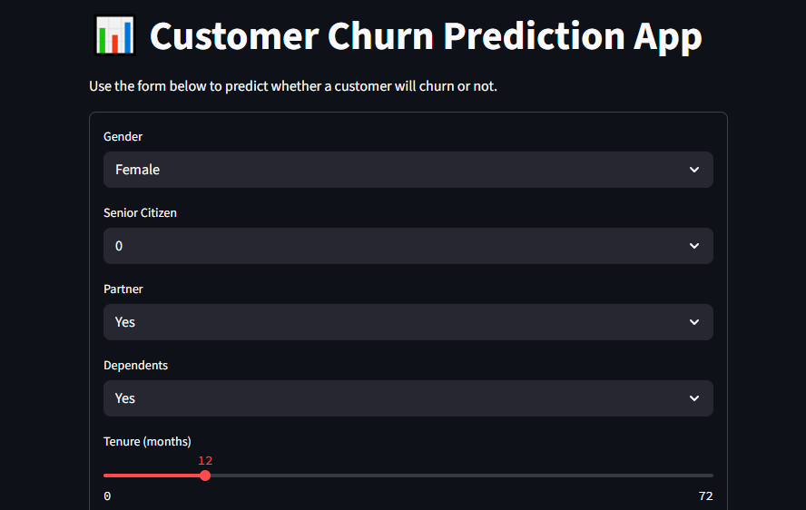
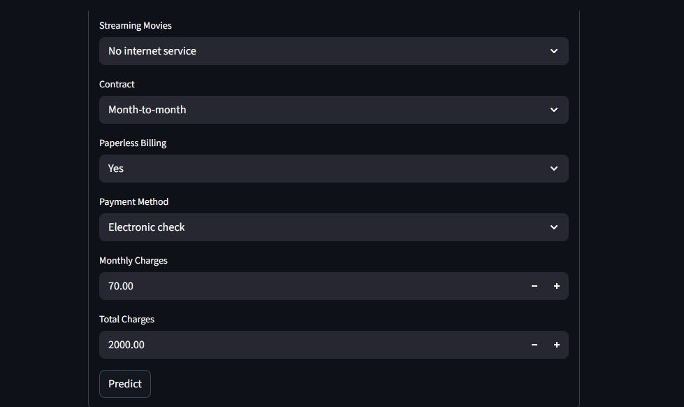
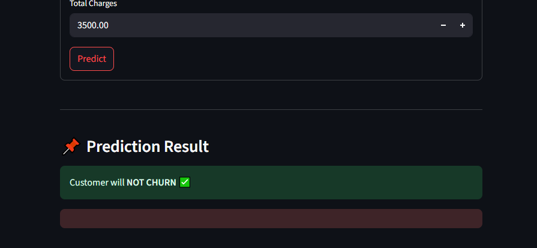

# 🔮 Customer Churn Prediction with Machine Learning



This is a complete machine learning project to predict whether a customer will churn (i.e., stop using the service) based on their contract, payment behavior, and service usage data.

I built a classification model using **Scikit-Learn**, deployed it using **Streamlit**, and included a clean UI for easy predictions.

---

## 📁 Project Structure

## 📁 customer_churn_prediction/

├── main.py  Full training pipeline with preprocessing and model saving

├── app.py  Streamlit app for manual prediction

├── requirements.txt  All dependencies

├── model/  Saved model, scaler, encoders

├── data/  Input dataset (Telco Customer Churn)

├── screenshots/  Streamlit UI snapshots

└── README.md  Project documentation


---

## 📉 Dataset Used

**Telco Customer Churn** from IBM Watson:
- Columns include `gender`, `SeniorCitizen`, `Contract`, `MonthlyCharges`, etc.
- Target column: `Churn` (`Yes` = will churn, `No` = not churn)

---

## 🧠 Model Details

- **Model**: Logistic Regression (can be replaced with others)
- **Preprocessing**: Label Encoding + Standard Scaling
- **Performance**:
  - Accuracy: ~92%
  - Good precision on `No Churn`
  - Decent recall for `Churn` customers

---

## 📷 App Interface (Streamlit)

| Input Form - Top | Input Form - Bottom | Result Output |
|------------------|---------------------|---------------|
|  |  |  |

---

## 🚀 How to Run It Locally

1. **Install dependencies**:
    ```bash
    pip install -r requirements.txt
    ```

2. **Train the model** (if needed):
    ```bash
    python main.py
    ```

3. **Run the Streamlit app**:
    ```bash
    streamlit run app.py
    ```

---

## 👨‍💻 Developed By

**[Jabran Adeel](https://github.com/jabran-adeel)**   

AI & ML Developer | Gen AI | Model Deployment | Data Analytics | Insight Generation

---

## 📌 Features

✅ Manual input for predictions  
✅ Clean UI using Streamlit  
✅ Fully preprocessed dataset  
✅ Model saving and reusability  
✅ Visual & Interactive interface  
✅ Easy to extend and deploy

---

## 📦 Future Improvements

- Add support for batch prediction via CSV upload
- Try deep learning models for better accuracy
- Deploy on Hugging Face Spaces or Render.com

---

## 💬 Feedback

Pull requests, issues, or ideas? You're welcome!
